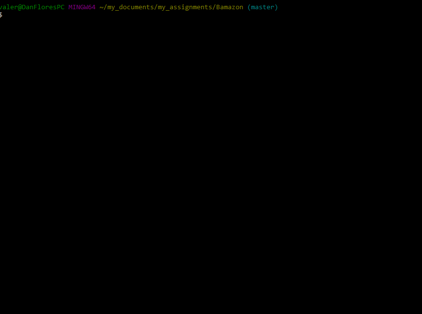
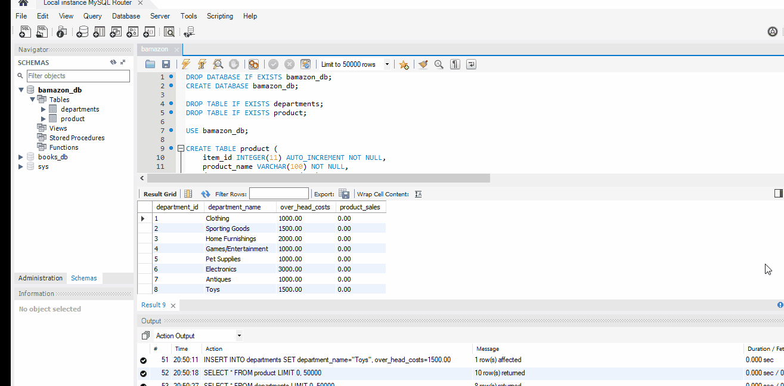
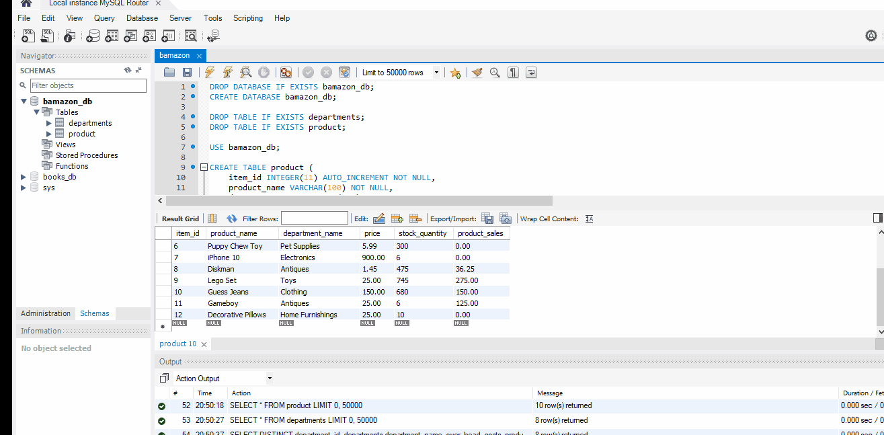
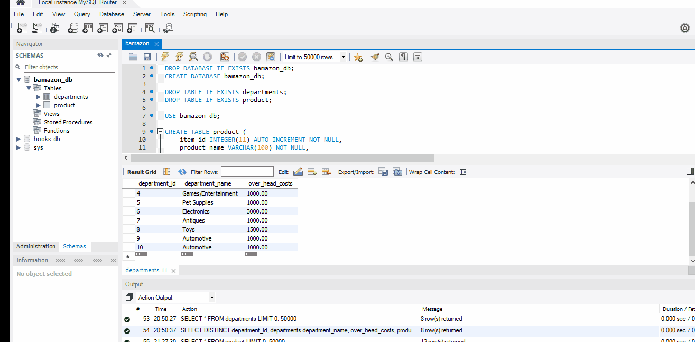

# Bamazon
This project terminal-based shopping app that allows a user to interact with the Bamazon store database. As a customer, the user shops from the items offered; as a manager, the user keeps track of inventory and adds new items for sale; as a supervisor, the user tracks sales and adds new departments to the store.

## Getting Started
To obtain a copy of the script for this app, please visit https://github.com/valeriemiller5/Bamazon

## Prerequisites
The package.json is included in the Github repository.  In order to run this app, the user will need to install the package.
'npm install'

### These packages are required to play the game:
### inquirer
`npm install inquirer`
### mysql
`npm install mysql`
### cli-table
This package renders a simple, clean-looking table that makes viewing the Bamazon items easier to see.\
`npm install cli-table`
### colors
This package adds color and font-weight to command line text for easier viewing.\
`npm install colors`

## Running the tests
As the code is run, arguments for errors have been added for testing and informing user when input is not recognized, as well as logs to identify when node.js code has communicated with MySQL. These items were commented-out for a cleaner view in the demo GIFs, but can be un-commented when the script is run.

## Issues Encountered
While working on this project, the Customer and Manager JS files work as planned; however, the Supervisor file had issues with displaying the departments (department names repeat as now sales numbers update), and though new departments appear in the "departments" table on the MySQL database, they do not render in the table when the Supervisor node command is made.

## Examples
### Customer View
This is a view of the Customer file - when a customer logs in, a table is displayed with items they may chose to purchase.  They are prompted to either continue making purchases or leave the app once an initial choice has been made.

### Manager View
This is the initial view of the Manager file.  The manager may look at the current inventory, look up the items low on inventory, add to the stock, and add new items.
#### Inventory Available

#### Add Inventory to Low Stock

#### Add New Item to Inventory

### Supervisor View
This is the view of the Supervisor file.  It is currently unfinished due to lack of time.  These view show the issues currently experienced with departments repeating when the purchase total is updated, and new departments not appearing on the table when added.
#### Department Info Table

### MySQL View
This view shows how the changes made in the command line using Node.js changed the information in the MySQL database.
#### New Product Added
This view shows that the "Decorative Pillows" added in the Manager file appears in the MySQL database

#### New Department Added
This view shows that the "Automotive" department added in the Supervisor file appears in the MySQL database (it appears twice due to a previous trial of this file).

#### Merge Tables
This view shows that data from both the "product" table and the "departments" table are combined into one table.  The code to determine the profitability of each department has not been completed.

## Built With
* Node.js - language used to build the app
* Colors - a Node.js package used to prettify the data in the terminal with colors
* Inquirer - a Node.js package used to create question prompts
* mysql - a Node.js package used to allow Node to communicate with a MySQL database

## Authors
Valerie Flores - Initial work

## License
This project is licensed under the MIT License - see the LICENSE.md file for details

## Acknowledgments
Thank you to UCI Coding Bootcamp classmates for your help and suggestions, and the many examples of other coders online.